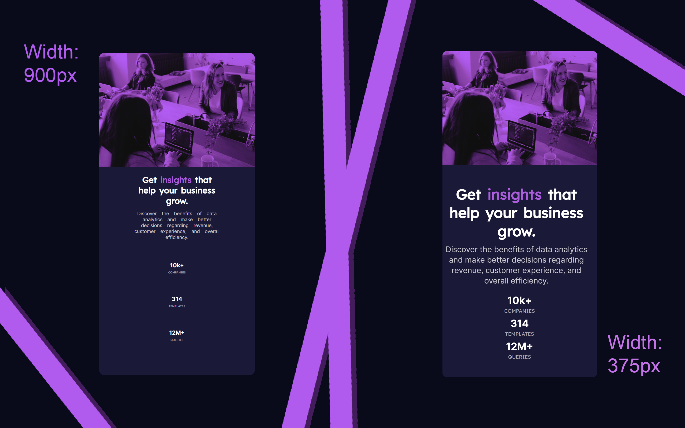

# Frontend Mentor - Stats preview card component solution

This is a solution to the [Stats preview card component challenge on Frontend Mentor](https://www.frontendmentor.io/challenges/stats-preview-card-component-8JqbgoU62). Frontend Mentor challenges help you improve your coding skills by building realistic projects. 

## Table of contents

- [Overview](#overview)
  - [The challenge](#the-challenge)
  - [Screenshot](#screenshot)
  - [Links](#links)
- [My process](#my-process)
  - [Built with](#built-with)
  - [What I learned](#what-i-learned)
- [Author](#author)

## Overview

### The challenge

This project was not as difficult as I thought it would be. I took the opportunity to make a good resolution for devices from: 900px to 660px wide and 659px to 375px wide.

### Screenshot

### Links

- Solution URL: [No link Yet]()
- Live Site URL: [Link of the Site | Stats Card](https://emilyfelicio.github.io/Stats_Card/)

## My process

### Built with

- HTML5
- CSS3
- Media Query
- CSS Grid

### What I learned

I was able to have more control of the media query, this is good because I had difficulty understanding how it worked. I had a lot of use of Google's devtools, which was essential to integrate responsive design.

## Author

- My Portfolio - [Emily Felicio](https://emilyfelicio.github.io/Portfolio/Portfolio/HTML/)
- Frontend Mentor - [@EmilyFelicio](https://www.frontendmentor.io/profile/EmilyFelicio)
